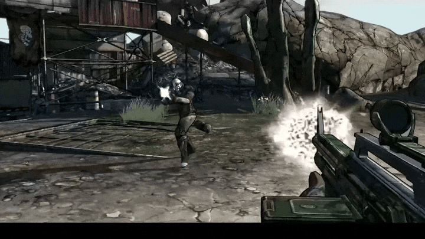

<p align="center">
  
</p>

<h1 align="center">Vaulter</h1>

<p align="center"><b>Tune, patch and mod Borderlands in one click.</b><br>
Better graphics, fewer crashes, mods and bug fixes, without editing a single file.</p>

<p align="center">
  <a href="https://github.com/RusticStack/Vaulter/releases/latest"></a>
</p>

<p align="center">
  
  
  
</p>

<p align="center">
  
</p>

<p align="center"><i>Formerly Vault Patcher.</i></p>

## What it does

- **One-click setup.** Pick the upgrades you want and Vaulter installs them all: borderless
  native resolution, a smooth framerate matched to your monitor, no motion blur or texture
  pop-in, skipped intro movies, the 4 GB memory patch, the DXVK Vulkan renderer for steadier
  frame times, an HD visual upgrade, and popular bug-fix and quality-of-life mods.
- **Every setting, explained.** 82 settings for Borderlands 2, each with what it does, how
  much FPS it costs, and side-by-side screenshots so you can see the difference before
  you apply it.
- **Presets.** Community Essentials, Clean Look, Pandora Ultra, Balanced, Competitive FPS,
  Potato Mode, or back to Factory Settings, then fine-tune from there.
- **Mods made easy.** Installs and updates the mod SDK for you, and adds, enables or removes
  mods with a click (or by dropping files on the window).
- **Always reversible.** Every change is backed up first. Restore any backup, or undo
  everything, in one click. If the game or its launcher resets your settings, *Re-apply all*
  puts them back.
- **Play from Vaulter.** Launch the game your way (with or without its launcher), and
  Vaulter steps out of the way while you play.
- **Feels like part of Windows.** A native Windows 11 app that follows your light or dark
  mode and accent color. It's light on your PC and uses almost no CPU while idle.

## Supported games

| Game | Support |
|---|---|
| Borderlands 2 | Full |
| Borderlands: Game of the Year Enhanced | Full |
| Borderlands: The Pre-Sequel | Preview (settings, presets, mod SDK) |

Steam and Epic Games installs are found automatically; you can also pick the folder yourself.

## Getting started

1. [Download `Vaulter.exe`](https://github.com/RusticStack/Vaulter/releases/latest). There's
   no installer: put it in any folder and run it.
2. Windows may show a SmartScreen warning because the app isn't code-signed yet. Choose
   **More info → Run anyway**. You can check the download against `SHA256SUMS.txt` on the
   release page.
3. Open **One-click setup**, tick what you want, and press **Upgrade game**. Close the game
   first: Vaulter won't change anything while it's running.

Your settings, backups and profiles stay in a `Vaulter Data` folder next to the exe, so you
can move or back up the app with its data. Coming from Vault Patcher? Your data moves over
automatically the first time you run Vaulter.

Found a bug? **App settings → Copy diagnostics**, then
[open an issue](https://github.com/RusticStack/Vaulter/issues) and paste it in.

---

## For developers

Vaulter is written in Rust on [GPUI](https://github.com/zed-industries/zed/tree/main/crates/gpui)
and [gpui-component](https://github.com/longbridge/gpui-component), with our own fork of both in
`vendor/` (acrylic, Mica compositing, frames on demand and more; see `vendor/README.md`).

### Build

```sh
cargo run                        # debug
cargo build --release            # the shipped exe
cargo build --profile quick      # release speed with parallel codegen, for testing
cargo test                       # unit tests
cargo test -- --ignored --nocapture   # read-only checks against a local BL2 install
```

`cargo build --release` produces one self-contained `Vaulter.exe`: fonts, icons, the logo
and the comparison images are embedded, and the C runtime is linked statically
(`.cargo/config.toml`). Mods and DXVK are downloaded on demand. The app icon is scaled at
build time from `assets/brand/logo.png`, which Blender renders from
`assets/brand/source/logo.py` (`blender -b --python assets/brand/source/logo.py -- logo.png 1024`).

Requires Windows 10/11; Mica needs Windows 11 22H2 or later (earlier versions get a solid
background). Text uses Segoe UI Variable and icons come from the installed Segoe Fluent
Icons; Noto Sans is bundled under the OFL as a fallback.

Environment overrides: `VAULTER_THEME=light|dark` previews a theme, `VAULTER_ACCENT=#RRGGBB`
sets the accent fill, and `VAULTER_DATA_DIR` moves the data folder.

### How it works

- **Settings** are edited in place: only the lines involved change, comments and formatting
  are kept, and the launcher's private `LauncherConfig\WillowEngine.ini` stays in sync.
  Edits are staged until *Apply* (Ctrl+S), with *Review* and *Undo*.
- **Exe patches** (Large Address Aware and the classic BL2/TPS console edits) are matched by
  byte signature and only offered when they match exactly once.
- **Vaulter Community Patch** is built on the user's PC from pinned upstream files: the
  Unofficial Community Patch's bug-fix section (no balance, loot or difficulty changes),
  apple1417's Text Fixes, Apocalyptech's Sorted Fast Travel and Gearbox's official hotfixes,
  merged into `Binaries/VaultPatcher.blcm` for Text Mod Loader. Nothing third-party is
  redistributed; see `src/textmod.rs`.
- **Comparison images** for Borderlands 2 are our own and ship inside the exe. Anyone can
  re-shoot them from **App Settings → Tools → Comparison Capture**: it writes each option,
  launches the game into a save, grabs the window via a small SDK helper, and restores the
  settings. Nvidia's tweak guide pages are linked, never bundled.
- **Data** lives in `Vaulter Data` next to the exe, or `%APPDATA%\Vaulter` when that folder
  isn't writable.

### Architecture

```
src/
  core/        game-agnostic: ini engine, Steam/Epic detection, backups, PE/hex patching,
               game art (Steam library cache, exe icons)
  tweaks/      tweak model (Control + Binding), ConfigSet, table builders
  games/       one module per game; willow.rs holds the shared BL2/TPS catalog
  pages/       one module per page kind; each renders from the shared Workspace
  mods.rs      SDK + mod install logic
  patches.rs   exe patch definitions
  workspace.rs shared app state and every mutation
  health.rs    Overview health checks and the diagnostics report
  applied.rs   what Vaulter last wrote, so "Re-apply" can put it back
  profiles.rs  named settings profiles (JSON)
  compare.rs   bundled per-setting comparison images and the capture tool
  app.rs       window shell: title bar, navigation pane, page host, Apply bar, toasts, dialogs
  theme.rs     WinUI theme brushes (mirrored into gpui-component), rarity colors, icons
  win11.rs     Windows theme and accent, Mica, animation setting, system icon glyphs
  ui.rs        widgets: buttons, switches, sliders, chips, setting rows
vendor/        our fork of gpui and gpui-component; see vendor/README.md
```

- **Adding a tweak:** add one entry to the game's `TWEAKS` table (e.g. `games/willow.rs`)
  with `toggle`, `slider`, `choice` or `custom`. Keys listed after the first are mirror
  copies, written only if that file exists. Tests check ids, categories and presets.
- **Adding a page:** add a `PageKind` variant, a module in `pages/` and a match arm in
  `pages::render`, then list it in a game's `nav`.
- **Adding a game:** create `games/<id>.rs` with a `GameDef` (detection, config folder, ini
  files, tweaks, presets, patches, mod support, nav) and register it in `games::all()`.

### Sources

Tweak keys and values were checked against a live install and the game's localization
files. Background research came from PCGamingWiki, the Nvidia BL2/TPS tweak guide, OpenBLCMM
(`IniTweaksPanel`, `HexDictionary`), the BLCMods Hex-Edits wiki and the bl-sdk projects.

## License

Vaulter is free software under the [GNU General Public License v3.0 or later](LICENSE), made by
[RusticStack](https://github.com/RusticStack). Bundled assets keep their own licenses: Noto Sans
(SIL OFL, `assets/fonts/NotoSans-OFL.txt`). Borderlands is a trademark of Gearbox Software;
Vaulter isn't affiliated with Gearbox or 2K.
